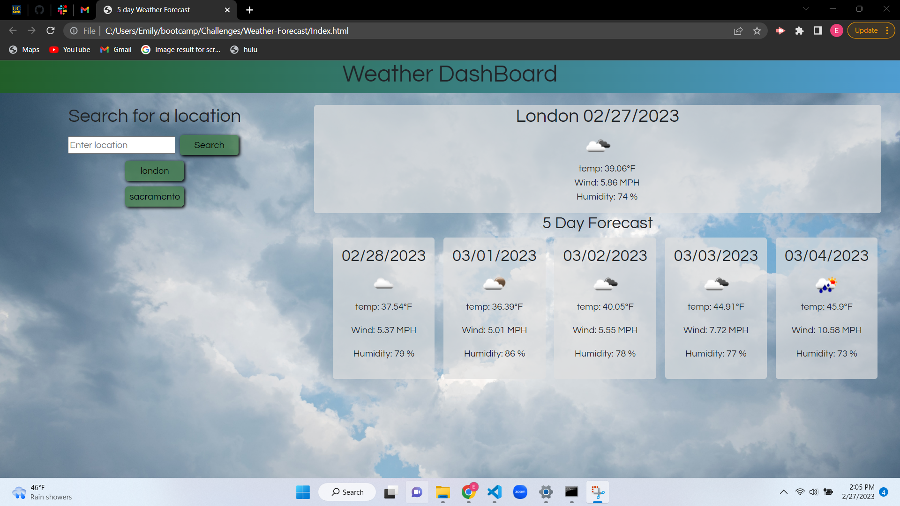

# Weather-Forecast

## Description

This project is going to help users find weather information for any location. This is great for planning a trip! No more guessing what clothes you will need to pack! This was a great learning lesson on how to navigate through API's. 

## Installation

n/a

## Usage

This project can be used by searching any location into the search input field to view the weather forecast. Once the user has searched for locations, they can use the search history to view the weather forecast as well. along with showing the weather for today and a 5 day forecast, the background image will also change to the orresponding weather for today. 

## Credits

Open Weather Map API

## License

MIT

https://github.com/Emilymora1207/Weather-Forecast.git

